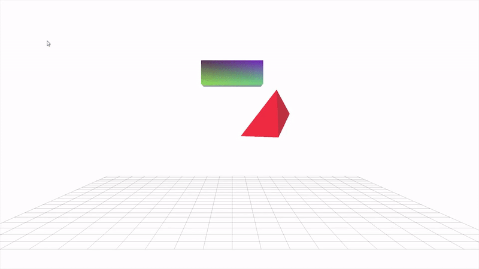

# Rigid Body Simulation
- A polyhedral object moves around within the environment and exhibit both *linear* and *rotational* motion
  - Handle mass, orientation/rotation, angular velocity, and angular moment of inertia

- Integrator
  - Implicit Euler
  - Explicit Euler
  - RK2

- Collision detection and handling
  - Face-vertex cases
  - Edge-edge cases

- Result 
  
